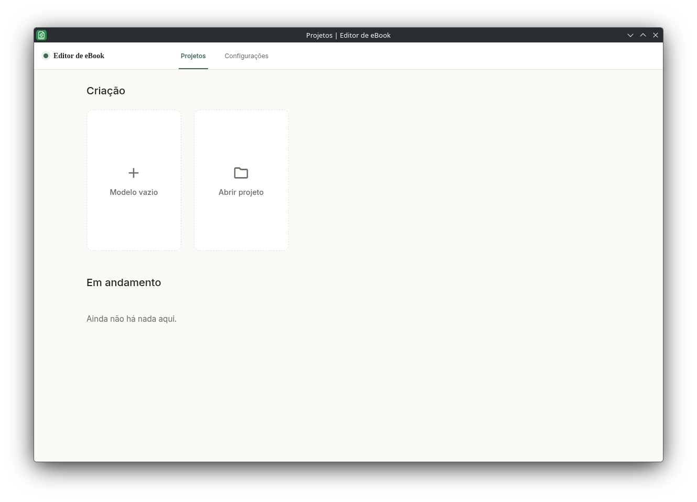
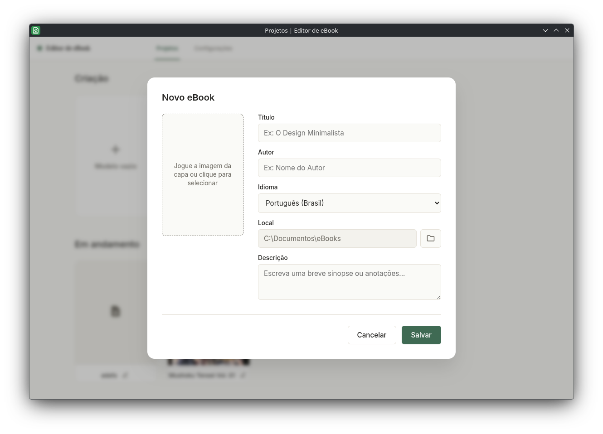
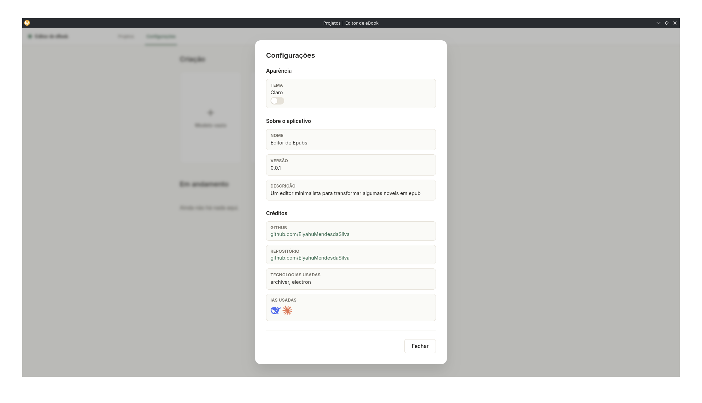
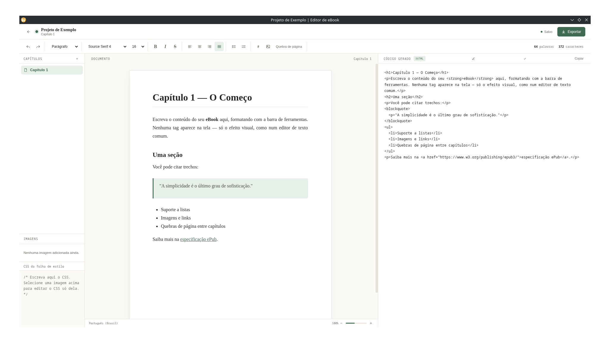

# Editor de eBook

**Versão 0.0.3** — Um aplicativo de desktop minimalista para escrever e exportar eBooks em **ePub** e **PDF**, com editor de texto rico, organização de capítulos, geração do `.epub` sem dependências externas de compressão e exportação para PDF com visualização fiel.

Construído com **Electron**, **HTML**, **CSS** e **JavaScript puro** — sem frameworks de front-end.

A organização de código está documentada em [ARCHITECTURE.md](ARCHITECTURE.md). A camada Electron fica em `src/main` e cada tela fica em `src/renderer`.

| **Tela** | **Preview** |
|---|---|
| Dashboard |  |
| Novo Projeto |  |
| Configurações |  |
| Editor |  |

---

## Funcionalidades

- **Gerenciamento de projetos** — crie, abra, edite e exclua projetos de eBook, cada um salvo em sua própria pasta local, com prevenção automática de duplicatas por título.
- **Capa personalizada** — arraste e solte ou selecione uma imagem de capa ao criar o projeto.
- **Editor de metadados** — edite título, autor, idioma e descrição do projeto após a criação.
- **Editor de texto** com:
  - Títulos, parágrafos e citações
  - Negrito, itálico e riscado
  - Alinhamento de texto e listas (ordenadas/não ordenadas)
  - Inserção de links, imagens e quebras de página
  - Contagem de palavras e caracteres em tempo real
- **Busca no texto** — localize palavras no capítulo atual com contagem de ocorrências e navegação entre resultados.
- **Organização por capítulos** — barra lateral para adicionar, reordenar (drag & drop) e navegar entre capítulos.
- **Estilização de imagens** — edição de CSS específico por imagem ou global, com pré-visualização do código XHTML gerado.
- **Tipografia** — seletor de fonte (Inter, Arial, Georgia, Times New Roman) e controle de tamanho e entrelinha, aplicados em tempo real ao editor.
- **Exportação em dois formatos:**
  - **EPUB** — monta a estrutura `mimetype`, `META-INF/container.xml`, `content.opf` e `toc.ncx` e compacta tudo em um ZIP válido "na mão", sem depender de pacotes como `archiver` ou `jszip`.
  - **PDF** — gera um arquivo HTML completo com CSS embutido e converte via impressão nativa do Electron.
- **Modo escuro/claro** com persistência da preferência do usuário (sem flash de tema ao carregar).
- **Tela de configurações** com informações do app, versão, tecnologias usadas e link para o repositório.
- **Sistema de fontes** — fontes Arial, Georgia, Inter e Times New Roman inclusas para renderização fiel nos formatos exportados, com suporte a importação de fontes externas.

## Telas

| Tela | Descrição |
|---|---|
| **Projetos** | Dashboard inicial com criação/abertura de projetos e lista de projetos em andamento |
| **Editor** | Editor de texto com toolbar completa, sidebar de capítulos/imagens e painel de código gerado (XHTML) |
| **Configurações** | Tema, informações e créditos do aplicativo |

> Os projetos criados ficam registrados no diretório de dados do usuário (`app.getPath('userData')/projects.json`) e são exibidos na seção "Em andamento" do Dashboard.

## Tecnologias

- [Electron](https://www.electronjs.org/) — empacotamento e APIs de sistema (diálogos de pasta, sistema de arquivos, etc.)
- HTML5 + CSS3
- JavaScript (Vanilla)

##  Exportação

Ao exportar um projeto, o app oferece dois formatos:

### EPUB
Gera um arquivo `.epub` válido contendo:
- Estrutura `OEBPS` com manifesto e spine (`content.opf`)
- Sumário de navegação (`nav` + `toc.ncx`, compatível com EPUB 2 e 3)
- Capítulos convertidos para XHTML com fechamento automático de tags void e saneamento de entidades HTML para XML
- Imagens e estilos CSS copiados para o pacote

### PDF
Gera um arquivo `.pdf` montando um HTML completo com CSS embutido, fontes inclusas e renderizado via `BrowserWindow` do Electron, preservando a formatação visual do editor.

## Status
O projeto está em desenvolvimento ativo.

## Créditos

Desenvolvido por [elyahumendes](https://github.com/ElyahuMendesdaSilva)

## Licença
Este projeto está sob a licença GNU General Public License v3.0 (GPL-3.0). Você é livre para usar, estudar, modificar e redistribuir este software. Qualquer versão modificada ou trabalho derivado que você distribuir também deve ser mantido sob a licença GPL-3.0 (copyleft). Veja o arquivo LICENSE para mais detalhes.
